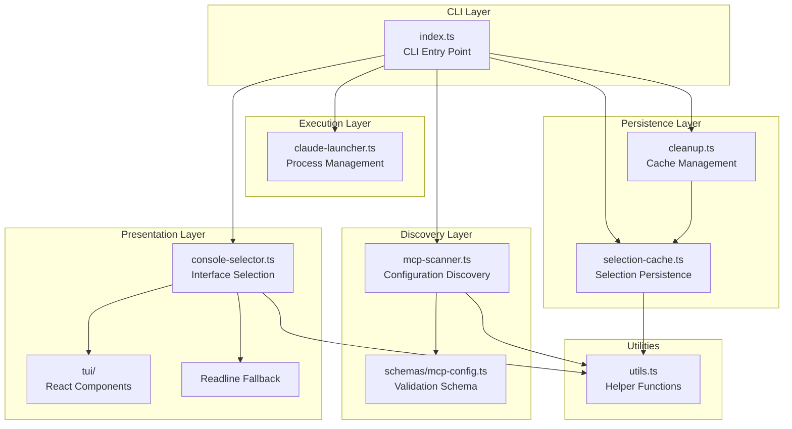
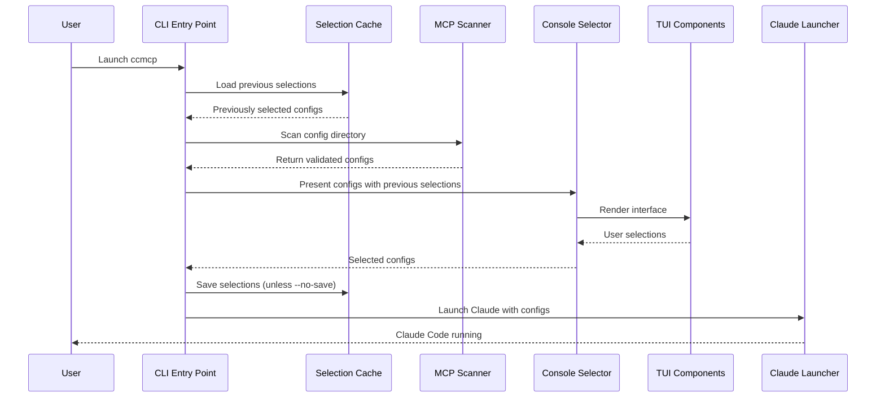
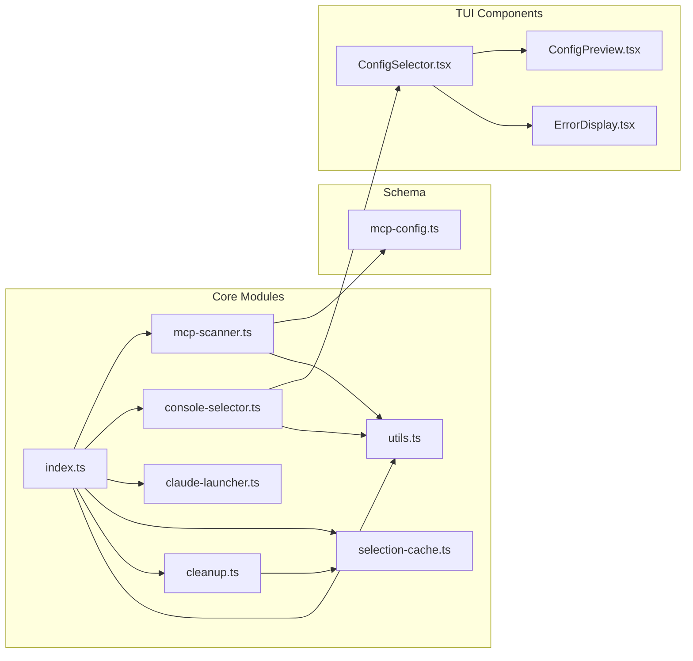
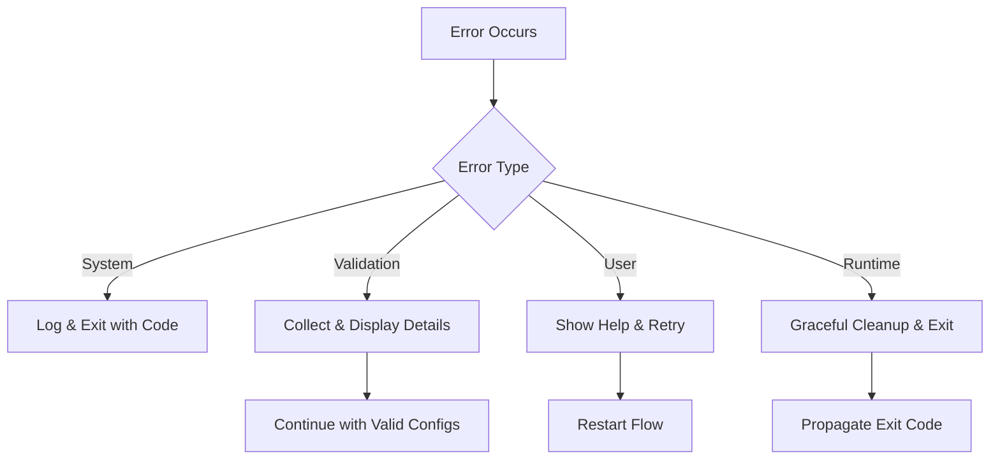
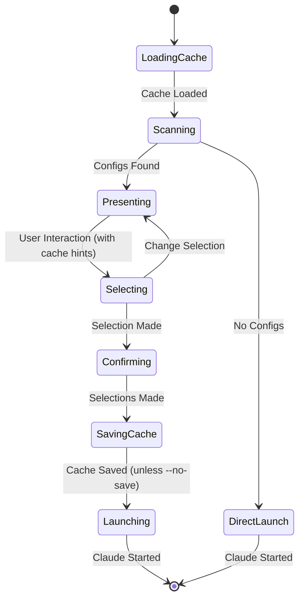

# System Architecture Specification

## Overview

The ccmcp application follows a **modular, functional architecture** with clear separation of concerns organized into distinct layers. The system is designed for maintainability, testability, and extensibility while providing both interactive and programmatic interfaces.

## Architectural Principles

### 1. Separation of Concerns

Each module has a single, well-defined responsibility:

- CLI layer handles argument parsing and orchestration
- Discovery layer manages configuration scanning and validation
- Presentation layer provides user interface components
- Execution layer manages process spawning and lifecycle
- Persistence layer handles selection caching and cache management

### 2. Interface Segregation

Components depend on abstractions rather than concrete implementations:

- Scanner interface for configuration discovery
- Selector interface for user interaction
- Launcher interface for process management
- Cache interface for selection persistence

### 3. Fail-Fast Design

Early validation and error detection:

- Schema validation at configuration load time
- TTY detection for interface selection
- Directory existence checks before scanning

### 4. Graceful Degradation

Fallback mechanisms for various environments:

- TUI falls back to readline interface
- Direct Claude launch when no configs found
- Error recovery with helpful user messages

## System Layers



## Core Design Patterns

### 1. Strategy Pattern

**Interface Selection Strategy**: The system selects between TUI and readline interfaces based on TTY detection.

```typescript
// Pseudo-implementation
interface SelectionStrategy {
  selectConfigs(configs: MCPConfig[]): Promise<MCPConfig[]>;
}

class TUIStrategy implements SelectionStrategy {
  async selectConfigs(configs: MCPConfig[]): Promise<MCPConfig[]> {
    // React/Ink based selection
  }
}

class ReadlineStrategy implements SelectionStrategy {
  async selectConfigs(configs: MCPConfig[]): Promise<MCPConfig[]> {
    // Text-based selection
  }
}
```

### 2. Builder Pattern

**Configuration Validation**: Schema validation builds validated configuration objects with detailed error reporting.

```typescript
// Schema-based validation and building
const validatedConfig = mcpConfigSchema.parse(rawConfig);
```

### 3. Observer Pattern

**React Component State**: TUI components use React state management for reactive updates.

```typescript
// Component state management
const [selectedConfigs, setSelectedConfigs] = useState<string[]>([]);
const [showPreview, setShowPreview] = useState(false);
const [showingInvalidConfigs, setShowingInvalidConfigs] = useState(false);
const [expandedInvalidConfigs, setExpandedInvalidConfigs] = useState<
  Set<number>
>(new Set());
```

### 4. Command Pattern

**CLI Argument Processing**: Commands are parsed and executed through a structured flow.

```typescript
// Command processing flow
const args = parseArgs(process.argv.slice(2));
await executeCommand(args);
```

### 5. Repository Pattern

**Selection Persistence**: Cached selections are stored and retrieved using a repository-like interface.

```typescript
// Load cached selections
const previouslySelected = await loadSelections(projectDir, configDir);

// Save selections for next time
await saveSelections(projectDir, configDir, selectedNames);
```

## Data Flow Architecture



## Module Dependencies



## Error Handling Architecture

### Error Classification

1. **System Errors**: File system access, permission issues
2. **Validation Errors**: Schema validation failures
3. **User Errors**: Invalid input, missing configurations
4. **Runtime Errors**: Process spawning, signal handling

### Error Propagation Strategy



### Error Recovery Mechanisms

- **Partial Failure**: Continue with valid configurations when some fail validation
- **Fallback Interfaces**: Switch from TUI to readline on TTY issues
- **Graceful Cleanup**: Handle process signals and cleanup resources
- **Helpful Messages**: Provide actionable error messages with suggestions

## Concurrency Model

### Async/Await Pattern

The application uses async/await throughout for:

- File system operations (configuration scanning)
- User interface interactions (selection waiting)
- Process spawning (Claude Code execution)

### Parallel Processing

- **Configuration Scanning**: Process multiple files simultaneously using `Promise.all()`
- **Validation**: Parallel schema validation for better performance
- **Non-blocking UI**: React components handle state updates asynchronously

## State Management

### Application State

- **Configuration List**: Discovered and validated MCP configs
- **Selection State**: User's current configuration selections
- **Cached State**: Previously selected configurations stored per project/config-dir
- **UI State**: Interface mode, preview toggle, error display state, invalid config expansion

### State Flow



## User Interface Features

### Terminal UI (TUI) Capabilities

The TUI provides a rich interactive experience built with React and Ink:

#### Navigation & Selection

- **Arrow Keys**: Navigate through valid configurations
- **Spacebar**: Toggle individual config selection
- **Enter**: Confirm selections and launch Claude Code
- **'a' Key**: Select all valid configurations
- **'c' Key**: Clear all selections

#### Preview & Inspection

- **'p' Key**: Toggle live preview of selected configuration
- **'i' Key**: Toggle display of invalid configurations
- **'e' Key**: Toggle error details for invalid configs (when viewing invalid configs)
- **'q' Key / Ctrl+C**: Quit without launching

#### Visual Indicators

- **Selection State**: Checkbox indicators `[x]` for selected, `[ ]` for unselected
- **Current Item**: Inverse/bold highlighting of current selection
- **Previous Selections**: Dimmed text showing "(previously selected)" for cached choices
- **Valid/Invalid**: Color-coded borders (green for valid, red for invalid)

#### Layout

- **Split View**: Optional side-by-side config list and preview pane
- **Invalid Configs Section**: Collapsible section showing validation errors
- **Footer Summary**: Real-time count and list of selected configs

### Readline Fallback Interface

For non-TTY environments (CI/CD, pipes, etc.), a text-based interface provides:

- Numbered list of configurations
- Comma-separated input for selections (e.g., "1,3,5")
- Special commands: "all", "none", or Enter for cached selections
- Clear indication of previously selected configs
- Graceful handling of invalid input

## Persistence Layer Architecture

### Cache Storage Strategy

The system implements a file-based caching mechanism to persist user selections across sessions.

#### Cache Location

- **Windows**: `%LOCALAPPDATA%\ccmcp`
- **Unix/Linux/macOS**: `$XDG_CACHE_HOME/ccmcp` or `~/.cache/ccmcp`

#### Cache Key Generation

Cache keys are generated using SHA-256 hashing of the combined project directory and config directory:

```typescript
const key = sha256(`${projectDir}::${configDir}`).substring(0, 16);
const cacheFile = `selections-${key}.json`;
```

#### Project Detection

The system intelligently detects the project context:

1. **Git Repository**: Uses `git rev-parse --show-toplevel` to find the repository root
2. **Git Worktree**: Detects worktrees and uses the main repository path for shared cache
3. **Fallback**: Uses current working directory if not in a git repository

This ensures that selections are shared across worktrees but isolated per project.

#### Cache Schema

```typescript
interface SelectionCache {
  version: 1;
  projectDir: string;
  configDir: string;
  lastModified: string;
  selectedConfigs: string[];
}
```

### Cache Management

#### Cleanup Operations

The `cleanup` command provides three types of cleanup:

1. **Stale Cache Entries**: Remove cache for non-existent project directories
2. **Invalid Server References**: Remove references to deleted config files
3. **Broken Symlinks**: Remove broken symlinks in the config directory

#### Cleanup Modes

- **Interactive**: Prompts user for confirmation before each operation
- **Dry Run**: Shows what would be cleaned without making changes (`--dry-run`)
- **Automatic**: Skips all prompts and proceeds with cleanup (`--yes`)

### CLI Options

#### Cache Control Flags

- `--ignore-cache` or `-i`: Skip loading previously selected configs
- `--clear-cache`: Clear all cached selections and exit
- `--no-save` or `-n`: Don't save selections (ephemeral mode)

#### Cleanup Command

```bash
ccmcp cleanup [--dry-run] [--yes]
```

#### Environment Variables

- `CCMCP_CONFIG_DIR`: Override default config directory location

## Extension Points

### 1. Configuration Sources

- Currently supports JSON files
- Extensible to YAML, TOML, or remote sources
- Plugin architecture for custom discovery

### 2. Interface Types

- Current: TUI and readline
- Extensible to web UI, desktop app, or API
- Interface factory pattern supports new types

### 3. Validation Rules

- Zod schema-based validation
- Custom validation rules can be added
- Support for configuration-specific validators

### 4. Launch Targets

- Currently launches Claude Code
- Extensible to other applications
- Configuration-driven launcher selection

### 5. Cache Storage Backends

- Current: File-based JSON storage
- Extensible to: SQLite, cloud storage, or key-value stores
- Interface allows custom storage implementations

## Performance Characteristics

### Memory Usage

- **Minimal**: Only loads necessary configurations into memory
- **Streaming**: Large configuration files handled efficiently
- **Cleanup**: Proper resource disposal and garbage collection

### Startup Time

- **Fast Boot**: Parallel configuration loading
- **Lazy Loading**: TUI components loaded on demand
- **Cached Validation**: Schema compilation cached for reuse

### Scalability

- **File Count**: Handles hundreds of configuration files efficiently
- **Configuration Size**: Supports large configuration files with streaming
- **User Interface**: Responsive even with many configurations

## Security Considerations

### Input Validation

- All configuration files validated against strict schemas
- CLI arguments sanitized and validated
- Process arguments properly escaped
- Cache directory paths validated to prevent traversal attacks

### Process Security

- Child process spawning with minimal privileges
- Signal handling prevents zombie processes
- Environment variable isolation

### File System Access

- Read-only access to configuration directories
- Path traversal prevention
- Permission validation before operations
- Cache files stored with user-only permissions

### Cache Security

- Cache keys use SHA-256 hashing to prevent directory traversal
- Project directories validated before cache operations
- Symlink targets validated to prevent security issues
- Cache version validation prevents format incompatibility
