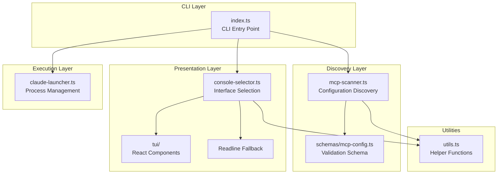
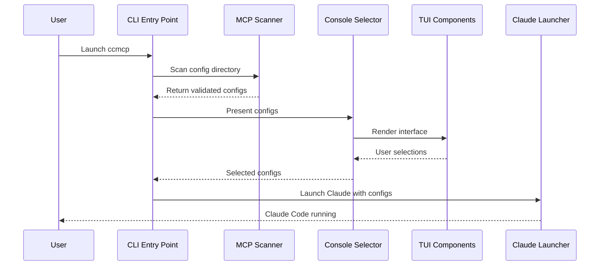
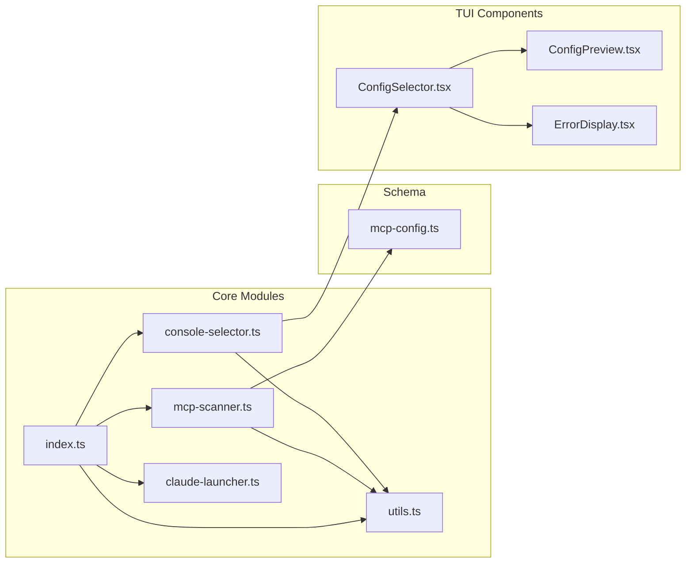
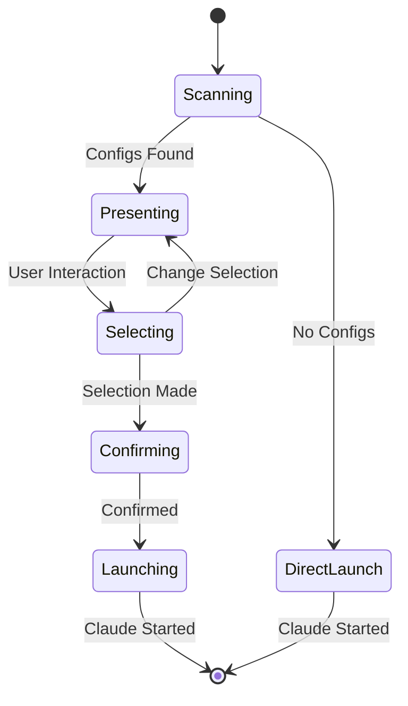

# System Architecture Specification

## Overview

The ccmcp application follows a **modular, functional architecture** with clear separation of concerns organized into distinct layers. The system is designed for maintainability, testability, and extensibility while providing both interactive and programmatic interfaces.

## Architectural Principles

### 1. Separation of Concerns

Each module has a single, well-defined responsibility:

- CLI layer handles argument parsing and orchestration
- Discovery layer manages configuration scanning and validation
- Presentation layer provides user interface components
- Execution layer manages process spawning and lifecycle

### 2. Interface Segregation

Components depend on abstractions rather than concrete implementations:

- Scanner interface for configuration discovery
- Selector interface for user interaction
- Launcher interface for process management

### 3. Fail-Fast Design

Early validation and error detection:

- Schema validation at configuration load time
- TTY detection for interface selection
- Directory existence checks before scanning

### 4. Graceful Degradation

Fallback mechanisms for various environments:

- TUI falls back to readline interface
- Direct Claude launch when no configs found
- Error recovery with helpful user messages

## System Layers



## Core Design Patterns

### 1. Strategy Pattern

**Interface Selection Strategy**: The system selects between TUI and readline interfaces based on TTY detection.

```typescript
// Pseudo-implementation
interface SelectionStrategy {
  selectConfigs(configs: MCPConfig[]): Promise<MCPConfig[]>;
}

class TUIStrategy implements SelectionStrategy {
  async selectConfigs(configs: MCPConfig[]): Promise<MCPConfig[]> {
    // React/Ink based selection
  }
}

class ReadlineStrategy implements SelectionStrategy {
  async selectConfigs(configs: MCPConfig[]): Promise<MCPConfig[]> {
    // Text-based selection
  }
}
```

### 2. Builder Pattern

**Configuration Validation**: Schema validation builds validated configuration objects with detailed error reporting.

```typescript
// Schema-based validation and building
const validatedConfig = mcpConfigSchema.parse(rawConfig);
```

### 3. Observer Pattern

**React Component State**: TUI components use React state management for reactive updates.

```typescript
// Component state management
const [selectedConfigs, setSelectedConfigs] = useState<string[]>([]);
const [showPreview, setShowPreview] = useState(false);
```

### 4. Command Pattern

**CLI Argument Processing**: Commands are parsed and executed through a structured flow.

```typescript
// Command processing flow
const args = parseArgs(process.argv.slice(2));
await executeCommand(args);
```

## Data Flow Architecture



## Module Dependencies



## Error Handling Architecture

### Error Classification

1. **System Errors**: File system access, permission issues
2. **Validation Errors**: Schema validation failures
3. **User Errors**: Invalid input, missing configurations
4. **Runtime Errors**: Process spawning, signal handling

### Error Propagation Strategy


### Error Recovery Mechanisms

- **Partial Failure**: Continue with valid configurations when some fail validation
- **Fallback Interfaces**: Switch from TUI to readline on TTY issues
- **Graceful Cleanup**: Handle process signals and cleanup resources
- **Helpful Messages**: Provide actionable error messages with suggestions

## Concurrency Model

### Async/Await Pattern

The application uses async/await throughout for:

- File system operations (configuration scanning)
- User interface interactions (selection waiting)
- Process spawning (Claude Code execution)

### Parallel Processing

- **Configuration Scanning**: Process multiple files simultaneously using `Promise.all()`
- **Validation**: Parallel schema validation for better performance
- **Non-blocking UI**: React components handle state updates asynchronously

## State Management

### Application State

- **Configuration List**: Discovered and validated MCP configs
- **Selection State**: User's current configuration selections
- **UI State**: Interface mode, preview toggle, error display state

### State Flow



## Extension Points

### 1. Configuration Sources

- Currently supports JSON files
- Extensible to YAML, TOML, or remote sources
- Plugin architecture for custom discovery

### 2. Interface Types

- Current: TUI and readline
- Extensible to web UI, desktop app, or API
- Interface factory pattern supports new types

### 3. Validation Rules

- Zod schema-based validation
- Custom validation rules can be added
- Support for configuration-specific validators

### 4. Launch Targets

- Currently launches Claude Code
- Extensible to other applications
- Configuration-driven launcher selection

## Performance Characteristics

### Memory Usage

- **Minimal**: Only loads necessary configurations into memory
- **Streaming**: Large configuration files handled efficiently
- **Cleanup**: Proper resource disposal and garbage collection

### Startup Time

- **Fast Boot**: Parallel configuration loading
- **Lazy Loading**: TUI components loaded on demand
- **Cached Validation**: Schema compilation cached for reuse

### Scalability

- **File Count**: Handles hundreds of configuration files efficiently
- **Configuration Size**: Supports large configuration files with streaming
- **User Interface**: Responsive even with many configurations

## Security Considerations

### Input Validation

- All configuration files validated against strict schemas
- CLI arguments sanitized and validated
- Process arguments properly escaped

### Process Security

- Child process spawning with minimal privileges
- Signal handling prevents zombie processes
- Environment variable isolation

### File System Access

- Read-only access to configuration directories
- Path traversal prevention
- Permission validation before operations
