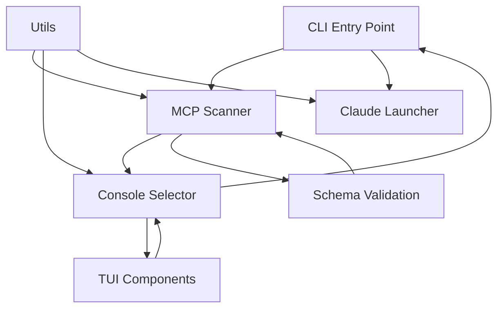

# Component Specifications

This document provides detailed specifications for all modules and components in the ccmcp application, including their interfaces, responsibilities, and implementation contracts.

## Core Modules

### CLI Entry Point (`src/index.ts`)

#### Purpose

Main application entry point that orchestrates the entire ccmcp workflow from argument parsing to Claude Code execution.

#### Key Responsibilities

- Parse and validate command-line arguments
- Separate ccmcp flags from Claude Code passthrough arguments
- Resolve configuration directory from multiple sources
- Coordinate between scanner, selector, and launcher modules
- Handle application-level error cases and exit codes

#### Interface Contract

```typescript
// CLI Arguments Interface
interface CLIArgs {
  help?: boolean;
  version?: boolean;
  "config-dir"?: string;
  _: string[]; // Remaining arguments for Claude Code
}

// Main execution function
async function main(): Promise<void>;
```

#### Implementation Details

**Argument Parsing**:

```typescript
const args = parseArgs({
  args: process.argv.slice(2),
  options: {
    help: { type: "boolean", short: "h" },
    version: { type: "boolean", short: "v" },
    "config-dir": { type: "string", short: "c" },
  },
  allowPositional: true,
});
```

**Config Directory Resolution Priority**:

1. CLI argument (`--config-dir` / `-c`)
2. Environment variable (`CCMCP_CONFIG_DIR`)
3. Default: `~/.claude/mcp-configs`

**Error Handling**:

- Invalid arguments: Display help and exit with code 1
- Missing config directory: Raise error and exit with code 1
- No configurations found: Launch Claude Code directly
- System errors: Display formatted error and exit with appropriate code

#### Dependencies

- `node:parseArgs` for argument parsing
- `node:path` for path resolution
- `node:os` for home directory detection
- Local modules: `mcp-scanner`, `console-selector`, `claude-launcher`, `utils`

---

### MCP Scanner (`src/mcp-scanner.ts`)

#### Purpose

Discovers, validates, and processes MCP configuration files in specified directories.

#### Key Responsibilities

- Scan directories for JSON configuration files
- Validate configurations against MCP schema
- Generate display names for configurations
- Handle parsing and validation errors gracefully
- Support parallel processing for performance

#### Interface Contract

```typescript
interface MCPConfig {
  filename: string;
  displayName: string;
  config: MCPConfigSchema;
  description?: string;
}

interface InvalidConfig {
  filename: string;
  displayName: string;
  error: string;
}

interface ScanResult {
  valid: MCPConfig[];
  invalid: InvalidConfig[];
}

async function scanMCPConfigs(configDir: string): Promise<ScanResult>;
```

#### Implementation Details

**File Discovery**:

- Scans directory for `*.json` files (non-recursive, top-level only)
- Filters out hidden files and directories (starting with `.`)
- Uses parallel processing with `Promise.all()` for performance

**Validation Process**:

```typescript
// Each file goes through this pipeline:
1. Read file content
2. Parse JSON (catch syntax errors)
3. Validate against Zod schema (catch validation errors)
4. Extract metadata for display
```

**Error Classification**:

- **Parse Errors**: Invalid JSON syntax
- **Validation Errors**: Schema validation failures with detailed paths
- **System Errors**: File access permissions, missing files

**Display Name Generation**:

- Extracts server names from configuration
- Falls back to filename without extension
- Handles multiple servers in single file

#### Dependencies

- `node:fs/promises` for file operations
- `node:path` for path manipulation
- `zod` for schema validation
- Local modules: `schemas/mcp-config`, `utils`

---

### Console Selector (`src/console-selector.ts`)

#### Purpose

Provides interactive configuration selection interface with fallback support for different terminal environments.

#### Key Responsibilities

- Detect TTY capability for interface selection
- Render TUI interface using React/Ink
- Provide readline fallback for non-TTY environments
- Handle user input and selection state
- Support both individual and bulk selection operations

#### Interface Contract

```typescript
interface SelectionOptions {
  configs: MCPConfig[];
  invalidConfigs?: InvalidConfig[];
  showInvalid?: boolean;
}

async function selectConfigs(options: SelectionOptions): Promise<MCPConfig[]>;
```

#### Implementation Details

**Interface Selection Strategy**:

```typescript
const canUseTUI = process.stdout.isTTY && process.stdin.isTTY;
if (canUseTUI) {
  return await showTUISelector(options);
} else {
  return await showReadlineSelector(options);
}
```

**TUI Mode Features**:

- React/Ink based interactive interface
- Keyboard navigation (↑/↓, space, enter)
- Real-time preview toggle
- Multi-select with visual feedback
- Invalid configuration viewing
- Status indicators and help text

**Readline Fallback Features**:

- Numbered list selection
- Multiple selection support (comma-separated)
- Range selection support (1-3,5,7-9)
- Clear prompts and validation
- Error handling with retry

#### Dependencies

- `react` and `ink` for TUI interface
- `node:readline/promises` for fallback interface
- Local modules: `tui` components, `utils`

---

### TUI Components (`src/tui/`)

#### ConfigSelector (`src/tui/ConfigSelector.tsx`)

**Purpose**: Main interactive configuration selection component.

**Props Interface**:

```typescript
interface ConfigSelectorProps {
  configs: MCPConfig[];
  invalidConfigs?: InvalidConfig[];
  onSelect: (configs: MCPConfig[]) => void;
  onExit: () => void;
}
```

**Key Features**:

- State management for selected configurations
- Keyboard event handling for navigation
- Visual feedback for selections
- Integration with preview and error display components

**State Management**:

```typescript
const [selectedConfigs, setSelectedConfigs] = useState<string[]>([]);
const [currentIndex, setCurrentIndex] = useState(0);
const [showPreview, setShowPreview] = useState(false);
const [showInvalid, setShowInvalid] = useState(false);
```

**Keyboard Shortcuts**:

- `↑/↓`: Navigate configurations
- `Space`: Toggle selection
- `a`: Select all
- `c`: Clear all selections
- `p`: Toggle preview panel
- `i`: Toggle invalid configurations
- `e`: Expand/collapse error details
- `Enter`: Confirm selections
- `q`: Quit without selection

#### ConfigPreview (`src/tui/ConfigPreview.tsx`)

**Purpose**: Real-time configuration file content preview.

**Props Interface**:

```typescript
interface ConfigPreviewProps {
  filename?: string;
  maxHeight?: number;
  maxWidth?: number;
}
```

**Implementation Details**:

- Async file reading with error handling
- JSON syntax highlighting (basic)
- Content truncation for large files
- Loading states and error display
- Responsive sizing based on terminal dimensions

#### ErrorDisplay (`src/tui/ErrorDisplay.tsx`)

**Purpose**: Collapsible display for configuration validation errors.

**Props Interface**:

```typescript
interface ErrorDisplayProps {
  invalidConfigs: InvalidConfig[];
  expanded: boolean;
}
```

**Features**:

- Collapsible error list
- Formatted error messages with file paths
- Color-coded error indicators
- Scrollable content for many errors

---

### Claude Launcher (`src/claude-launcher.ts`)

#### Purpose

Manages Claude Code process spawning with selected MCP configurations.

#### Key Responsibilities

- Construct Claude Code command with MCP configuration flags
- Handle process spawning and lifecycle management
- Use process replacement for seamless handover to Claude
- Manage signal forwarding and cleanup
- Propagate exit codes correctly

#### Interface Contract

```typescript
interface LaunchOptions {
  selectedConfigs: MCPConfig[];
  additionalArgs: string[];
}

async function launchClaude(options: LaunchOptions): Promise<void>;
```

#### Implementation Details

**Command Construction**:

```typescript
const claudeArgs = [
  ...options.selectedConfigs.map((config) => `--mcp-config=${config.filename}`),
  ...options.additionalArgs,
];
```

**Process Management**:

- Graceful shutdown on SIGINT/SIGTERM
- Cleanup of temporary resources
- Proper exit code propagation

#### Dependencies

- `node:child_process` for process management
- `node:process` for signal handling
- Local modules: `utils`

---

### Utilities (`src/utils.ts`)

#### Purpose

Shared utility functions for error formatting, string manipulation, and common operations.

#### Key Functions

**Error Formatting**:

```typescript
function formatError(error: unknown, context?: string): string;
// Standardizes error message formatting across the application
```

**Display Name Generation**:

```typescript
function generateDisplayName(
  filename: string,
  config?: MCPConfigSchema,
): string;
// Creates user-friendly display names for configurations
```

**Path Utilities**:

```typescript
function sanitizePath(path: string): string;
// Sanitizes and validates file paths for security
```

#### Implementation Details

- Consistent error message formatting with context
- Safe string manipulation with proper escaping
- Path validation and sanitization
- Helper functions for common operations

---

## Validation Schema (`src/schemas/mcp-config.ts`)

#### Purpose

Comprehensive Zod schema for validating MCP configuration files with support for multiple transport types.

#### Schema Structure

```typescript
// Base server configuration
const baseServerSchema = z.object({
  type: z.enum(["stdio", "http", "sse"]).optional(),
  env: z.record(z.string()).optional(),
});

// Transport-specific schemas
const stdioServerSchema = baseServerSchema.extend({
  command: z.string().min(1),
  args: z.array(z.string()).optional(),
});

const httpServerSchema = baseServerSchema.extend({
  url: z.string().url(),
  headers: z.record(z.string()).optional(),
});

const sseServerSchema = httpServerSchema; // Same as HTTP

// Main configuration schema
const mcpConfigSchema = z.object({
  mcpServers: z.record(
    z.discriminatedUnion("type", [
      stdioServerSchema,
      httpServerSchema,
      sseServerSchema,
      legacyServerSchema, // For backward compatibility
    ]),
  ),
  description: z.string().optional(),
});
```

#### Validation Features

- **Transport Type Detection**: Auto-detects server type based on configuration
- **Legacy Support**: Handles configurations without explicit `type` field
- **URL Validation**: Validates HTTP/SSE server URLs
- **Environment Variables**: Validates env var values are strings
- **Detailed Errors**: Provides specific error paths for debugging

#### Error Handling

- Comprehensive error message generation
- Path-specific error reporting
- Type-safe error objects with detailed context
- Support for partial validation and error collection

---

## Component Integration

### Data Flow Between Components



### Error Propagation

- Components throw typed errors with specific error codes
- Error messages are formatted consistently using utilities
- Partial failures are handled gracefully (e.g., some configs invalid)
- User-facing errors include actionable suggestions

### State Management

- Application state flows unidirectionally from CLI to components
- TUI components manage their own local state using React hooks
- Configuration selection state is maintained at the selector level
- No global state management - simple prop passing suffices

This component specification provides complete implementation details for recreating each module with identical functionality and behavior.
