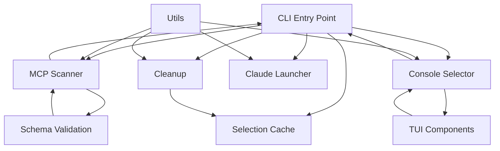

# Component Specifications

This document provides detailed specifications for all modules and components in the ccmcp application, including their interfaces, responsibilities, and implementation contracts.

## Core Modules

### CLI Entry Point (`src/index.ts`)

#### Purpose

Main application entry point that orchestrates the entire ccmcp workflow from argument parsing to Claude Code execution.

#### Key Responsibilities

- Parse and validate command-line arguments
- Separate ccmcp flags from Claude Code passthrough arguments
- Resolve configuration directory from multiple sources
- Coordinate between scanner, selector, and launcher modules
- Manage selection caching and cleanup operations
- Handle application-level error cases and exit codes

#### Interface Contract

```typescript
// CLI Arguments Interface
interface CliArgs {
  help?: boolean;
  version?: boolean;
  "config-dir"?: string;
  "ignore-cache"?: boolean;
  "clear-cache"?: boolean;
  "no-save"?: boolean;
  cleanup?: boolean;
  "dry-run"?: boolean;
  yes?: boolean;
}

// Main execution function
async function main(): Promise<number>;
```

#### Implementation Details

**Argument Parsing**:

The CLI implements custom argument parsing to separate ccmcp-specific flags from passthrough arguments:

```typescript
const rawArgs = process.argv.slice(2);
const ccmcpFlags = new Set([
  "-h",
  "--help",
  "-v",
  "--version",
  "--config-dir",
  "-i",
  "--ignore-cache",
  "--clear-cache",
  "-n",
  "--no-save",
  "--cleanup",
  "--dry-run",
  "--yes",
]);

// Separates ccmcp flags from passthrough arguments
// Handles combined short flags (e.g., -in -> -i -n)
// Converts "cleanup" command to --cleanup flag
```

**Config Directory Resolution Priority**:

1. CLI argument (`--config-dir`)
2. Environment variable (`CCMCP_CONFIG_DIR`)
3. Default: `~/.claude/mcp-configs`

**Selection Caching**:

- Loads previously selected configs unless `--ignore-cache` is set
- Saves selections for future runs unless `--no-save` is set
- Cache is project-specific based on git repository root
- Cache can be cleared with `--clear-cache`

**Cleanup Command**:

```typescript
ccmcp cleanup [--dry-run] [--yes]
```

- Removes stale cache entries for non-existent projects
- Removes invalid server references from cache files
- Removes broken symlinks from config directory
- Supports dry-run mode and automatic confirmation

**Error Handling**:

- Invalid arguments: Display help and exit with code 1
- Missing config directory: Raise `MissingConfigDirectoryError` and exit with code 1
- No configurations found: Launch Claude Code directly without configs
- Cleanup errors: Display summary with error list
- System errors: Display formatted error and exit with appropriate code

#### Dependencies

- `node:util` for parseArgs
- `node:path` for path resolution
- `node:os` for home directory detection
- `node:fs` for realpath operations
- Local modules: `mcp-scanner`, `console-selector`, `claude-launcher`, `selection-cache`, `cleanup`, `utils`

---

### MCP Scanner (`src/mcp-scanner.ts`)

#### Purpose

Discovers, validates, and processes MCP configuration files in specified directories.

#### Key Responsibilities

- Scan directories for JSON configuration files
- Validate configurations against MCP schema
- Generate display names for configurations
- Handle parsing and validation errors gracefully
- Support parallel processing for performance
- Throw specific error for missing config directory

#### Interface Contract

```typescript
interface McpConfig {
  name: string;
  path: string;
  description?: string;
  valid: boolean;
  error?: string;
}

class MissingConfigDirectoryError extends Error {
  readonly directoryPath: string;
  constructor(directoryPath: string);
}

async function scanMcpConfigs(configDir?: string): Promise<McpConfig[]>;
```

#### Implementation Details

**Config Directory Handling**:

- Defaults to `~/.claude/mcp-configs` if no directory specified
- Checks for directory existence using `stat()`
- Throws `MissingConfigDirectoryError` for ENOENT errors
- Re-throws other stat errors (permissions, etc.)

**File Discovery**:

- Scans directory for `*.json` files (non-recursive, top-level only)
- Uses parallel processing with `Promise.all()` for performance
- Returns empty array (with warning) on scan failures

**Validation Process**:

```typescript
// Each file goes through this pipeline:
1. Read file content
2. Parse JSON (catch SyntaxError)
3. Validate against Zod schema (validateMcpConfig)
4. Extract server names for display
5. Generate display name using formatConfigDisplayName utility
```

**Error Classification**:

- **Parse Errors**: JSON SyntaxError with message
- **Validation Errors**: Schema validation failures formatted using `formatValidationErrors()`
- **System Errors**: File access permissions and other errors

**Display Name Generation** (via `formatConfigDisplayName` utility):

- Single server matching filename: shows server name only
- Single server not matching filename: `filename → server-name`
- Multiple servers: `filename → server1, server2, ...`
- No servers: shows filename without extension

**Return Value**:

- Returns unified array of `McpConfig[]` sorted by name
- Each config has `valid` boolean and optional `error` message
- Invalid configs are included in the array (not separated)

#### Dependencies

- `node:fs/promises` for file operations
- `node:path` for path manipulation
- `node:os` for home directory
- Local modules: `schemas/mcp-config` for validation, `utils` for formatting

---

### Console Selector (`src/console-selector.ts`)

#### Purpose

Provides interactive configuration selection interface with fallback support for different terminal environments.

#### Key Responsibilities

- Detect TTY capability for interface selection
- Render TUI interface using React/Ink with cached selections
- Provide readline fallback for non-TTY environments
- Handle user input and selection state
- Support both individual and bulk selection operations
- Pass version and config directory information to TUI

#### Interface Contract

```typescript
async function selectConfigs(
  configs: McpConfig[],
  configDir: string,
  previouslySelected?: Set<string>,
): Promise<McpConfig[]>;
```

#### Implementation Details

**Interface Selection Strategy**:

```typescript
const canUseTUI = process.stdout.isTTY && process.stdin.isTTY;
if (canUseTUI) {
  // Use Ink TUI with version, configDir, and previouslySelected
  return new Promise((resolve) => {
    render(
      React.createElement(ConfigSelector, {
        configs,
        configDir,
        previouslySelected,
        version,
        onSelect: (selectedConfigs) => {
          waitUntilExit().then(() => resolve(selectedConfigs));
        },
      }),
    );
  });
} else {
  // Use readline fallback
  return selectConfigsReadline(configs, configDir, previouslySelected);
}
```

**TUI Mode Features**:

- React/Ink based interactive interface
- Keyboard navigation (↑/↓, space, enter)
- Real-time preview toggle with (p) key
- Multi-select with visual feedback
- Invalid configuration viewing with (i) key
- Displays previously selected configs with indicator
- Shows version in header
- Waits for TUI to fully exit before resolving
- Status indicators and help text

**Readline Fallback Features**:

- Numbered list selection
- Shows previously selected indicator
- Empty input uses previous selection if available
- Multiple selection support (comma-separated: 1,3,5)
- "all" keyword to select all valid configs
- "none" keyword to select nothing
- Clear prompts and validation
- Error handling with graceful fallback to no configs

**Signal Handling**:

- Creates signal cleanup handlers for SIGINT and SIGTERM
- Properly removes event listeners after readline completes
- Ensures readline interface is closed on errors

#### Dependencies

- `react` and `ink` for TUI interface
- `node:readline` for fallback interface
- Local modules: `tui/ConfigSelector`, `utils`

---

### TUI Components (`src/tui/`)

#### ConfigSelector (`src/tui/ConfigSelector.tsx`)

**Purpose**: Main interactive configuration selection component.

**Props Interface**:

```typescript
interface ConfigSelectorProps {
  configs: McpConfig[];
  onSelect: (configs: McpConfig[]) => void;
  configDir: string;
  previouslySelected?: Set<string>;
  version?: string;
}
```

**Key Features**:

- State management for selected configurations
- Keyboard event handling for navigation
- Visual feedback for selections
- Integration with preview and error display components
- Displays version in header
- Pre-selects previously selected configs
- Filters valid/invalid configs internally

**State Management**:

```typescript
const [selectedIndices, setSelectedIndices] = useState<Set<number>>(
  // Pre-populate with previously selected configs
  () => {
    const indices = new Set<number>();
    validConfigs.forEach((config, index) => {
      if (previouslySelected.has(config.name)) {
        indices.add(index);
      }
    });
    return indices;
  },
);
const [currentIndex, setCurrentIndex] = useState(0);
const [showingPreview, setShowingPreview] = useState(false);
const [showingInvalidConfigs, setShowingInvalidConfigs] = useState(false);
const [expandedInvalidConfigs, setExpandedInvalidConfigs] = useState<
  Set<number>
>(new Set());
```

**Keyboard Shortcuts**:

- `↑/↓`: Navigate configurations
- `Space`: Toggle selection
- `a`: Select all valid configs
- `c`: Clear all selections
- `p`: Toggle preview panel
- `i`: Toggle invalid configurations display
- `e`: Expand/collapse all error details (when viewing invalid configs)
- `Enter`: Confirm selections and exit
- `q` or `Ctrl+C`: Quit without selection

#### ConfigPreview (`src/tui/ConfigPreview.tsx`)

**Purpose**: Real-time configuration file content preview.

**Props Interface**:

```typescript
interface ConfigPreviewProps {
  config: McpConfig | null;
  width?: number;
  height?: number;
}
```

**Implementation Details**:

- Async file reading with error handling using `useEffect`
- JSON pretty-printing with 2-space indentation
- Content truncation for large files (based on height parameter)
- Line length truncation (based on width parameter)
- Loading states and error display
- Only previews valid configs
- Border color changes based on config validity (green/red)
- Shows "..." indicator when content is truncated

**Default Dimensions**:

- width: 40 characters
- height: 10 lines

#### ErrorDisplay (`src/tui/ErrorDisplay.tsx`)

**Purpose**: Display for individual configuration validation errors.

**Props Interface**:

```typescript
interface ErrorDisplayProps {
  config: McpConfig;
  expanded?: boolean;
}
```

**Features**:

- Returns null if config is valid (early exit)
- Shows config name and description
- Collapsible error details with red border
- Shows error message and file path when expanded
- Hint to press 'e' to toggle details (when not expanded)
- Color-coded indicators (red for error, blue for description, yellow for path, magenta for hint)

---

### Claude Launcher (`src/claude-launcher.ts`)

#### Purpose

Manages Claude Code process spawning with selected MCP configurations.

#### Key Responsibilities

- Construct Claude Code command with MCP configuration flags
- Locate claude executable in PATH
- Handle process spawning and lifecycle management
- Use process replacement via shell exec for seamless handover
- Manage signal forwarding and cleanup
- Propagate exit codes correctly

#### Interface Contract

```typescript
interface LaunchOptions {
  selectedConfigs: McpConfig[];
  passthroughArgs: string[];
}

async function launchClaudeCode(
  options: LaunchOptions,
  execFile?: typeof execFileSync,
): Promise<number>;
```

#### Implementation Details

**Command Construction**:

```typescript
const args: string[] = [];

// Add MCP config flags for each selected config
for (const config of selectedConfigs) {
  args.push("--mcp-config", config.path);
}

// Add any passthrough arguments
args.push(...passthroughArgs);
```

**Claude Executable Discovery**:

- Uses `execFileSync("which", ["claude"])` to locate claude in PATH
- Throws error if claude command not found
- Detects command not found by status code 1 or error message

**Process Replacement Strategy**:

```typescript
// 1. Find claude executable path
const claudePath = execFile("which", ["claude"]).trim();

// 2. Flush stdio for clean handover
process.stdout.write("");
process.stderr.write("");

// 3. Build command with proper shell escaping using shell-quote
const command = `exec ${quote([claudePath, ...args])}`;

// 4. Spawn with shell exec for true process replacement
const proc = spawn("sh", ["-c", command], { stdio: "inherit" });
```

**Process Management**:

- Spawns claude with `stdio: "inherit"` for proper terminal control
- Handles exit events to propagate exit codes
- Handles signal events to propagate signals to parent process
- Uses intentional `process.exit()` in event handlers for replacement semantics
- Returns Promise that never resolves (process exits via event handlers)
- On error, returns Promise resolving to exit code 1

**Error Handling**:

- Command not found: User-friendly error message suggesting installation
- Other errors: Formatted error message with details
- All errors return exit code 1

#### Dependencies

- `node:child_process` for process management (execFileSync, spawn)
- `shell-quote` for safe shell escaping
- Local modules: `utils` for error formatting

---

### Utilities (`src/utils.ts`)

#### Purpose

Shared utility functions for error formatting, version retrieval, and display name generation.

#### Key Functions

**Package Version Retrieval**:

```typescript
function getPackageVersion(): string;
// Reads version from package.json at build time
```

**Error Formatting**:

```typescript
function formatErrorMessage(error: unknown): string;
// Standardizes error message formatting across the application
// Returns error.message if Error, otherwise "Unknown error"
```

**Display Name Generation**:

```typescript
function formatConfigDisplayName(
  filename: string,
  serverNames: string[],
): string;
// Creates user-friendly display names for configurations
// Handles single/multiple servers and filename matching
```

#### Implementation Details

**Version Retrieval**:

- Uses `import.meta.url` to resolve module directory
- Reads package.json from parent directory
- Parses JSON and returns version field

**Error Message Formatting**:

- Type-guards to check if error is Error instance
- Extracts message property if available
- Returns generic message for unknown error types

**Display Name Logic**:

```typescript
// Removes .json extension from filename
const baseFilename = filename.replace(/\.json$/i, "");

if (serverNames.length === 0) return baseFilename;
if (serverNames.length === 1 && serverNames[0] === baseFilename) {
  return serverNames[0]; // Single server matching filename
}
if (serverNames.length === 1) {
  return `${baseFilename} → ${serverNames[0]}`; // Single server, different name
}
// Multiple servers
return `${baseFilename} → ${serverNames.join(", ")}`;
```

#### Dependencies

- `node:fs` for reading package.json
- `node:path` for path resolution
- `node:url` for ESM module path resolution

---

## Validation Schema (`src/schemas/mcp-config.ts`)

#### Purpose

Comprehensive Zod schema for validating MCP configuration files with support for multiple transport types.

#### Schema Structure

```typescript
// Transport-specific schemas
const StdioServerSchema = z.object({
  type: z.literal("stdio"),
  command: z.string().min(1, "Command cannot be empty"),
  args: z.array(z.string()).default([]),
  env: z.record(z.string(), z.string()).optional(),
});

const LegacyStdioServerSchema = z.object({
  command: z.string().min(1, "Command cannot be empty"),
  args: z.array(z.string()).default([]),
  env: z.record(z.string(), z.string()).optional(),
});

const HttpServerSchema = z.object({
  type: z.literal("http"),
  url: z.string().url("Must be a valid URL"),
  headers: z.record(z.string(), z.string()).optional(),
  env: z.record(z.string(), z.string()).optional(),
});

const SseServerSchema = z.object({
  type: z.literal("sse"),
  url: z.string().url("Must be a valid URL"),
  headers: z.record(z.string(), z.string()).optional(),
  env: z.record(z.string(), z.string()).optional(),
});

// Base server schema with conditional validation
const BaseServerSchema = z.object({
  type: z.enum(["stdio", "http", "sse"]).optional(),
  command: z.string().optional(),
  args: z.array(z.string()).default([]).optional(),
  env: z.record(z.string(), z.string()).optional(),
  url: z.string().optional(),
  headers: z.record(z.string(), z.string()).optional(),
});

// Server schema with superRefine for conditional validation
const ServerSchema = BaseServerSchema.superRefine((data, ctx) => {
  const serverType = data.type || "stdio"; // Default to stdio for legacy

  if (serverType === "stdio") {
    // Validate stdio requirements
  } else if (serverType === "http" || serverType === "sse") {
    // Validate HTTP/SSE requirements
  }
}).transform((data) => ({
  ...data,
  type: data.type || "stdio",
  args: data.args || [],
}));

// Main configuration schema
const McpConfigSchema = z.object({
  mcpServers: z.record(z.string(), ServerSchema).optional().default({}),
  description: z.string().optional(),
});
```

#### Validation Features

- **Transport Type Detection**: Auto-detects server type (defaults to stdio if missing)
- **Legacy Support**: Handles configurations without explicit `type` field
- **URL Validation**: Validates HTTP/SSE server URLs using Zod's `.url()` validator
- **Environment Variables**: Validates env var keys and values are strings
- **Conditional Validation**: Uses `superRefine` for type-specific validation
- **Type Transformation**: Ensures type field is always present after validation
- **Default Values**: Provides defaults for optional fields (args, mcpServers)
- **Detailed Errors**: Provides specific error paths for debugging

#### Exported Functions

```typescript
function validateMcpConfig(data: unknown): ValidationResult;
function formatValidationErrors(errors: ValidationError[]): string;
function extractServers(config: McpConfigType): Record<string, ServerConfig>;
```

#### Error Handling

- Returns `ValidationResult` with success/failure status
- Maps Zod issues to simplified `ValidationError` format
- Path-specific error reporting with full path array
- Formatted multi-line error messages
- Type-safe error objects with code and message

---

### Selection Cache (`src/selection-cache.ts`)

#### Purpose

Manages persistent caching of user's MCP configuration selections on a per-project basis.

#### Key Responsibilities

- Determine platform-specific cache directory
- Detect project directory (git repository root or worktree)
- Generate cache keys from project and config directory paths
- Load and save selection cache files
- Clear all cache entries on demand

#### Interface Contract

```typescript
interface SelectionCache {
  version: 1;
  projectDir: string;
  configDir: string;
  lastModified: string;
  selectedConfigs: string[];
}

function getCacheDir(): string;
function getProjectDir(executor?: typeof execSync): string;
async function loadSelections(
  projectDir: string,
  configDir: string,
): Promise<Set<string>>;
async function saveSelections(
  projectDir: string,
  configDir: string,
  selectedConfigs: string[],
): Promise<void>;
async function clearCache(): Promise<void>;
```

#### Implementation Details

**Cache Directory Resolution**:

Platform-specific cache directory locations:

- Windows: `%LOCALAPPDATA%\ccmcp` or `%USERPROFILE%\AppData\Local\ccmcp`
- XDG-compliant: `$XDG_CACHE_HOME/ccmcp`
- macOS/Linux fallback: `~/.cache/ccmcp`

**Project Directory Detection**:

```typescript
// 1. Get current git repository root
const gitRoot = execSync("git rev-parse --show-toplevel");

// 2. Check if in a worktree by listing all worktrees
const worktreeList = execSync("git worktree list --porcelain");

// 3. Parse first worktree entry (main worktree)
const mainWorktreePath = parseFirstWorktreePath(worktreeList);

// 4. Return main worktree path or current root
return mainWorktreePath || gitRoot;

// Fallback to process.cwd() if not in git repo
```

**Cache Key Generation**:

- Combines project and config directory paths with `::`
- Hashes using SHA-256
- Takes first 16 characters for compact filenames
- Cache files: `selections-{hash}.json`

**Load Behavior**:

- Returns empty Set if cache file doesn't exist
- Returns empty Set if version mismatch
- Returns empty Set if project/config directory mismatch
- Otherwise returns Set of selected config names

**Save Behavior**:

- Removes cache file if selectedConfigs is empty
- Creates cache directory if it doesn't exist
- Writes JSON with 2-space indentation
- Updates lastModified timestamp

**Clear Behavior**:

- Reads all files in cache directory
- Filters for files starting with `selections-`
- Removes all matching files
- Ignores errors if cache directory doesn't exist

#### Dependencies

- `node:child_process` for git commands (execSync)
- `node:crypto` for SHA-256 hashing
- `node:fs/promises` for file operations
- `node:os` for platform detection and homedir
- `node:path` for path manipulation

---

### Cleanup (`src/cleanup.ts`)

#### Purpose

Provides cache maintenance functionality to remove stale data and broken references.

#### Key Responsibilities

- Remove cache entries for non-existent projects
- Remove invalid server references from cache files
- Remove broken symlinks from config directory
- Support dry-run mode for previewing changes
- Interactive confirmation prompts (unless --yes flag)

#### Interface Contract

```typescript
interface CleanupOptions {
  configDir: string;
  dryRun?: boolean;
  yes?: boolean;
}

interface CleanupResult {
  staleCacheEntries: number;
  invalidServerReferences: number;
  brokenSymlinks: number;
  totalCacheFilesBefore: number;
  totalCacheFilesAfter: number;
  errors: string[];
}

async function cleanupCache(options: CleanupOptions): Promise<CleanupResult>;
```

#### Implementation Details

**Stale Cache Entry Cleanup**:

1. Scan all cache files in cache directory
2. Parse each SelectionCache JSON
3. Check if projectDir exists on filesystem
4. Collect stale entries (project doesn't exist)
5. Prompt user for confirmation (unless --yes)
6. Remove stale cache files (or report in dry-run mode)

**Invalid Server Reference Cleanup**:

1. Scan all cache files in cache directory
2. For each cache with existing projectDir:
   - Check if each selected config file exists
   - Collect invalid config names
3. Prompt user for confirmation (unless --yes)
4. Update cache files to remove invalid references
5. Remove cache file entirely if no valid configs remain
6. Update lastModified timestamp (or report in dry-run mode)

**Broken Symlink Cleanup**:

1. Scan config directory for \*.json files
2. For each file, check if it's a broken symlink:
   - Use stat() to check if symlink
   - Use readlink() to get target
   - Check if target exists
3. Collect broken symlinks
4. Prompt user for confirmation (unless --yes)
5. Remove broken symlinks (or report in dry-run mode)

**User Prompts**:

- Shows detailed list of items to be cleaned
- Asks for Y/n confirmation
- Default to Yes on empty input
- Skipped if --yes flag is set
- Skipped in dry-run mode (shows what would be done)

**Dry-Run Mode**:

- Shows all items that would be cleaned
- Prefixes output with `[DRY RUN]`
- Counts items but doesn't modify files
- Returns counts in CleanupResult

**Error Handling**:

- Collects errors in result.errors array
- Continues processing on individual file errors
- Reports config directory scan errors to console
- Returns all errors for user review

#### Dependencies

- `node:fs/promises` for file operations (access, readdir, readFile, readlink, rm, stat, writeFile)
- `node:path` for path manipulation
- `node:readline` for user prompts
- Local modules: `selection-cache` for cache directory and types

---

## Component Integration

### Data Flow Between Components



**Main Application Flow**:

1. **CLI Entry Point** parses arguments and determines mode:
   - `cleanup` command → runs Cleanup module
   - `--clear-cache` flag → clears Selection Cache
   - Normal mode → continues to config selection

2. **Selection Cache** loads previously selected configs for current project

3. **MCP Scanner** discovers and validates config files using Schema Validation

4. **Console Selector** presents configs to user:
   - TTY environments → renders TUI Components
   - Non-TTY → uses readline fallback
   - Pre-selects configs from Selection Cache

5. **Selection Cache** saves user's selections for future runs

6. **Claude Launcher** spawns Claude Code with selected configs

**Cleanup Flow**:

1. **Cleanup** module called from CLI Entry Point
2. Scans Selection Cache for stale entries
3. Validates config file references
4. Removes broken symlinks from config directory
5. Returns cleanup statistics

### Error Propagation

- Components throw typed errors (`MissingConfigDirectoryError`)
- Error messages are formatted consistently using `formatErrorMessage()` utility
- Partial failures are handled gracefully:
  - Invalid configs are included in results with `valid: false`
  - Scanner returns empty array on scan failures (with warning)
  - Cleanup continues on individual file errors
- User-facing errors include actionable suggestions
- Exit codes propagated correctly (0 = success, 1 = error)

### State Management

- Application state flows unidirectionally from CLI to components
- TUI components manage their own local state using React hooks:
  - `useState` for selections, preview toggle, error expansion
  - `useEffect` for file reading in preview
  - `useInput` for keyboard handling
- Configuration selection state:
  - Loaded from Selection Cache at start
  - Maintained in ConfigSelector component during selection
  - Saved to Selection Cache after confirmation
- Cache state persisted in platform-specific cache directory
- No global state management - simple prop passing and promise-based flow

### Caching Strategy

- **Cache Scope**: Per-project (git repository) and per-config-directory
- **Cache Key**: SHA-256 hash of `projectDir::configDir` (first 16 chars)
- **Cache Location**: Platform-specific cache directory
- **Cache Format**: JSON with version, metadata, and selected config names
- **Git Worktree Support**: Uses main worktree path for consistent caching
- **Invalidation**: Manual via `--clear-cache` or `cleanup` command

This component specification provides complete implementation details for recreating each module with identical functionality and behavior.
