# Visual Architecture Diagrams

This document contains comprehensive visual diagrams created with Mermaid to illustrate the ccmcp application's architecture, data flow, component interactions, and user experience.

## Application Flow Overview

### High-Level Application Flow

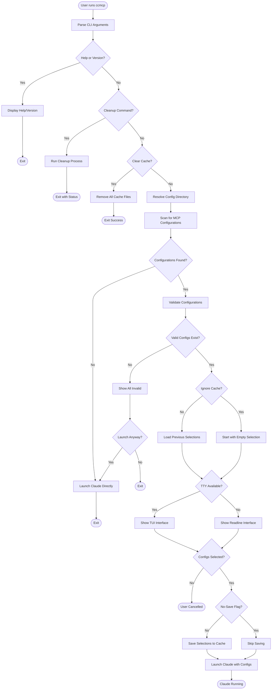

## Component Architecture

### System Architecture Diagram

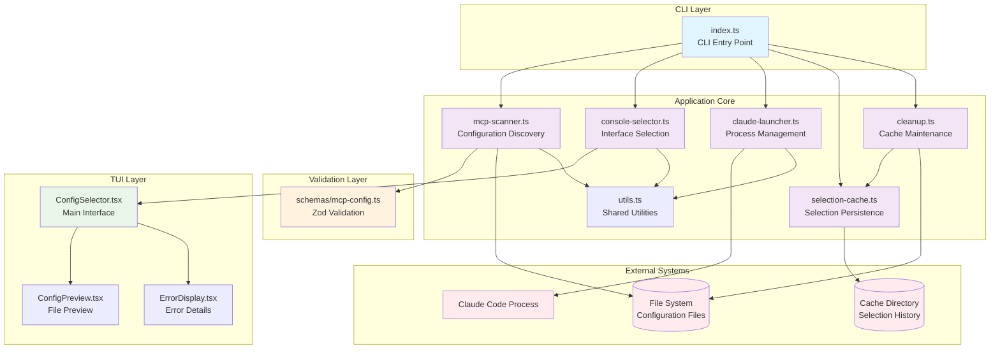

## Data Flow Diagrams

### Configuration Discovery and Validation Flow

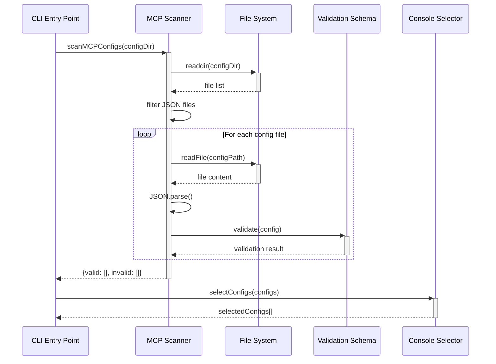

### User Interface State Machine

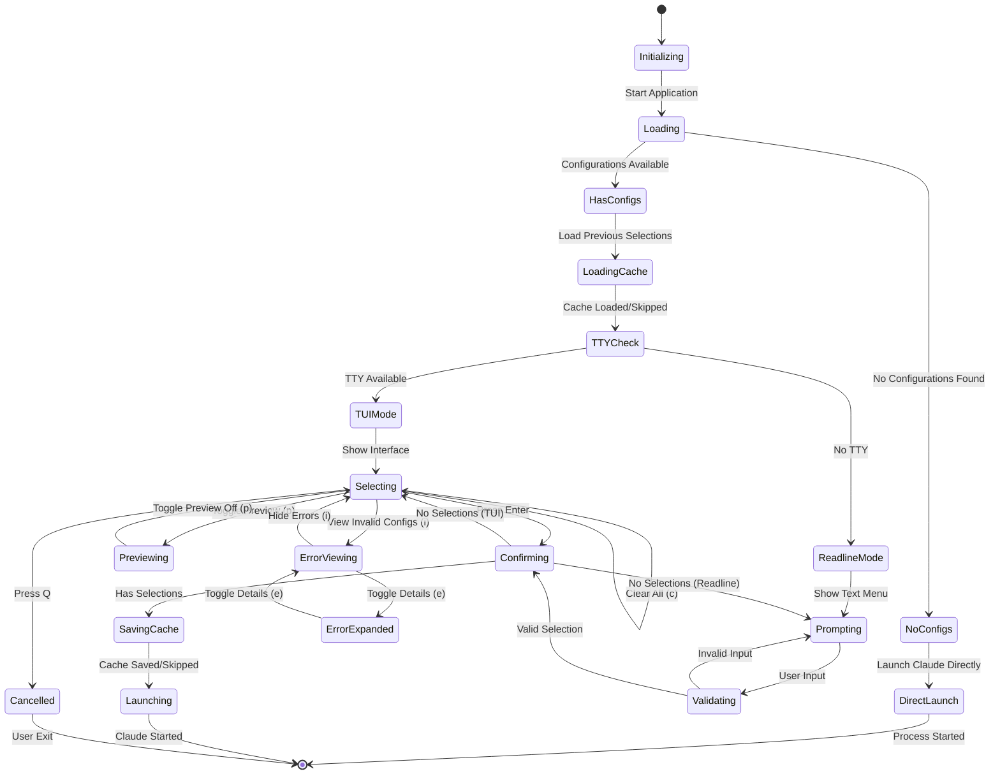

### TUI Component Interaction

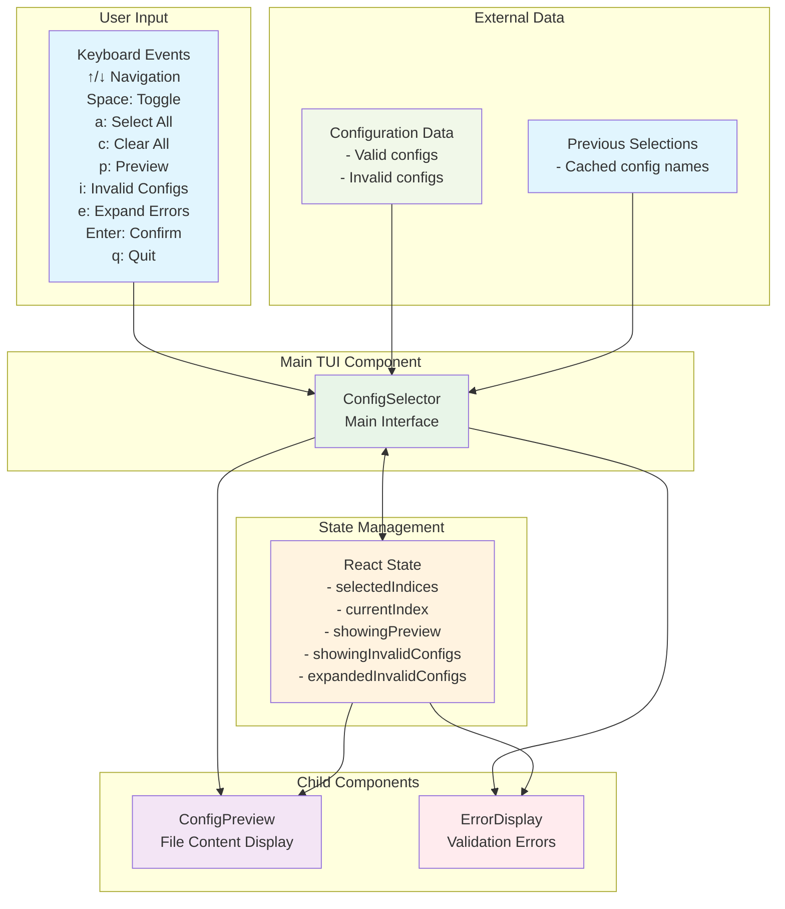

## Process Management

### Claude Code Launch Process

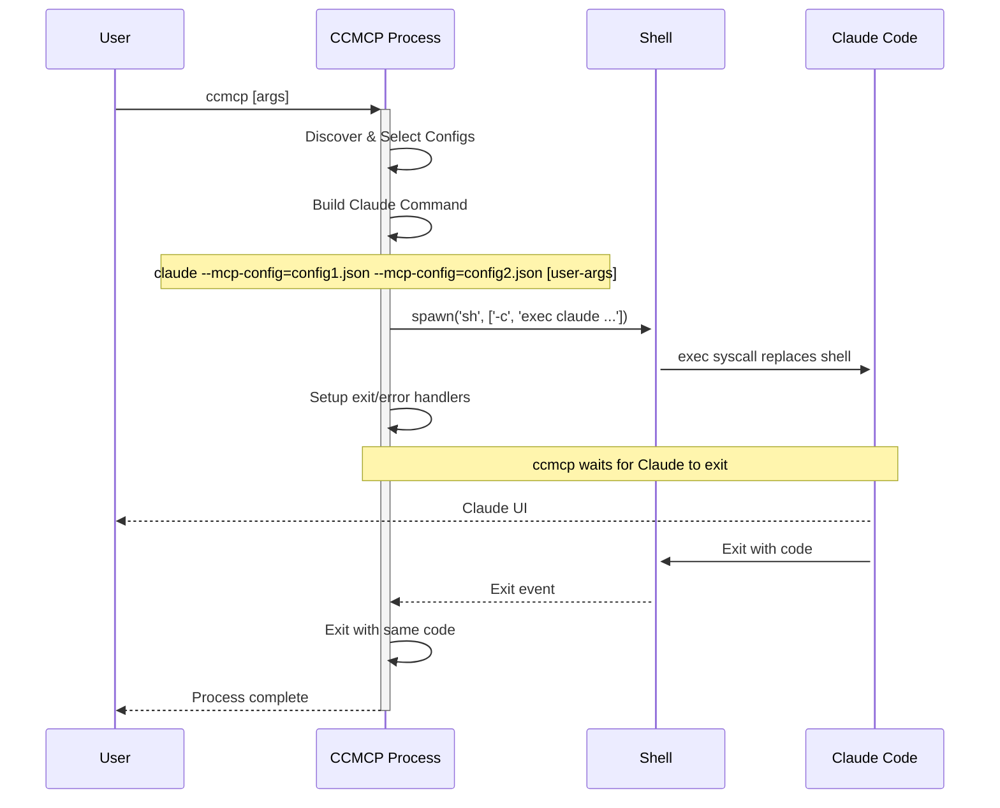

### Process Exit Handling Flow

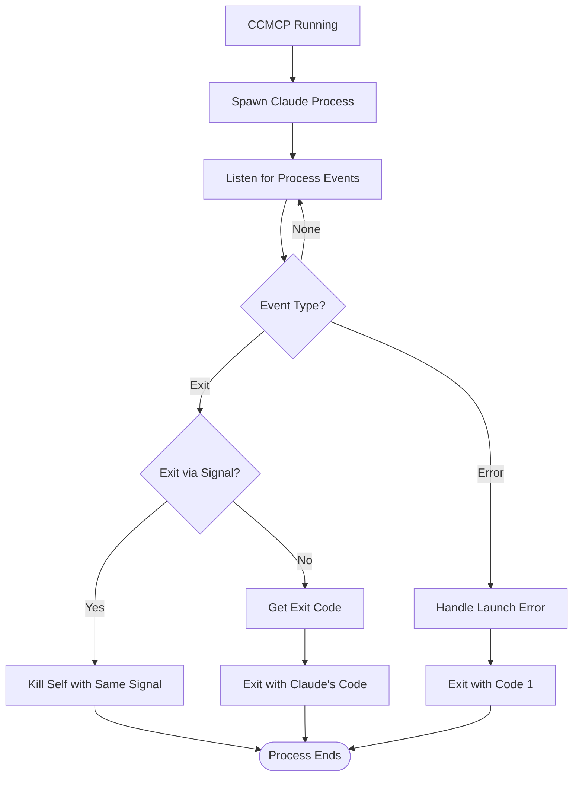

## Cache Management

### Selection Cache Flow

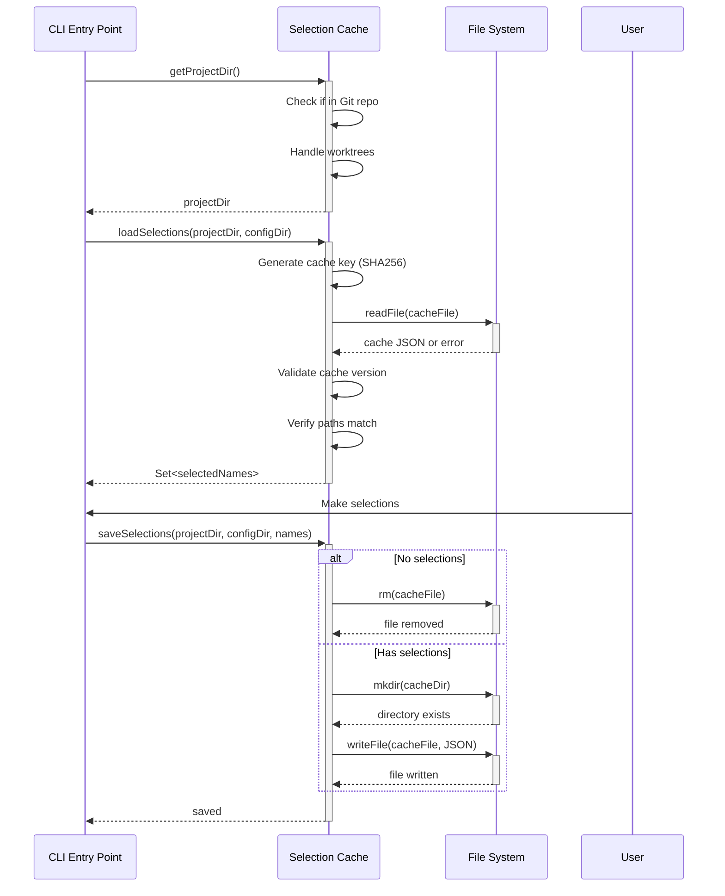

### Cleanup Process Flow

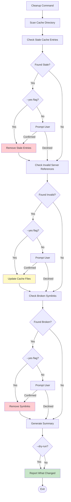

## Error Handling Diagrams

### Error Classification and Recovery

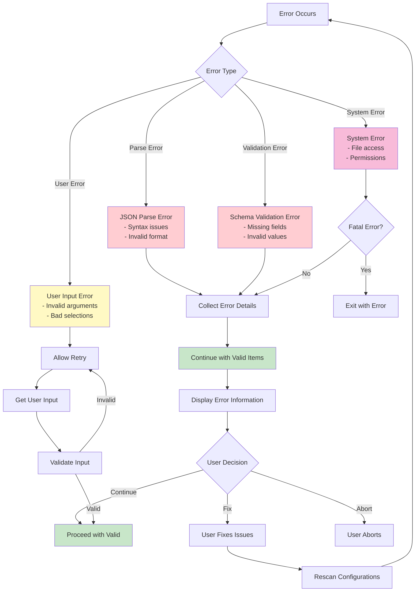

### Configuration Validation Pipeline

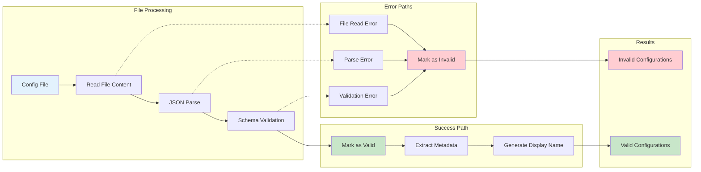

## User Experience Flow

### Complete User Journey

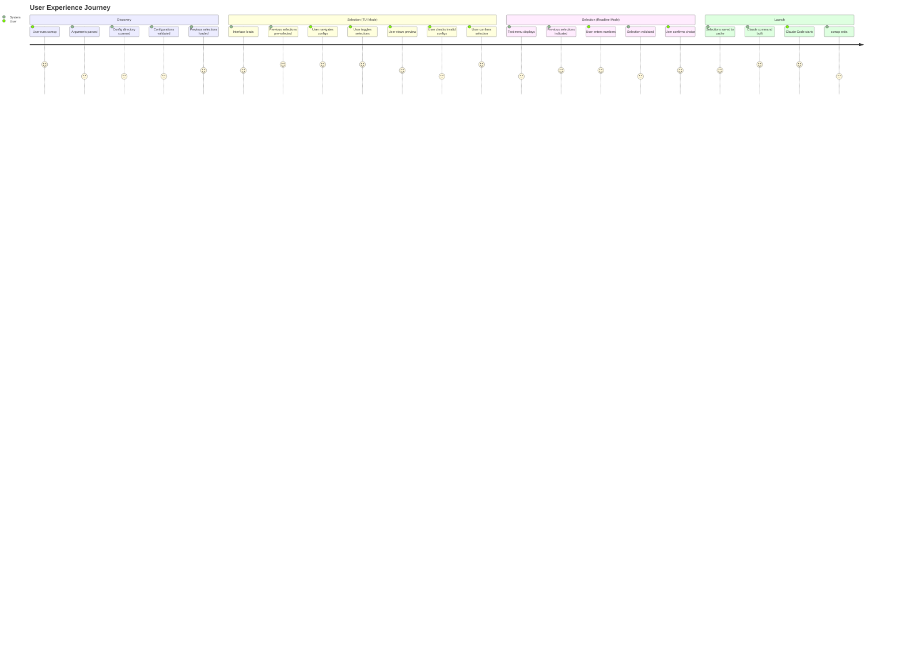

### Interface Adaptation Flow

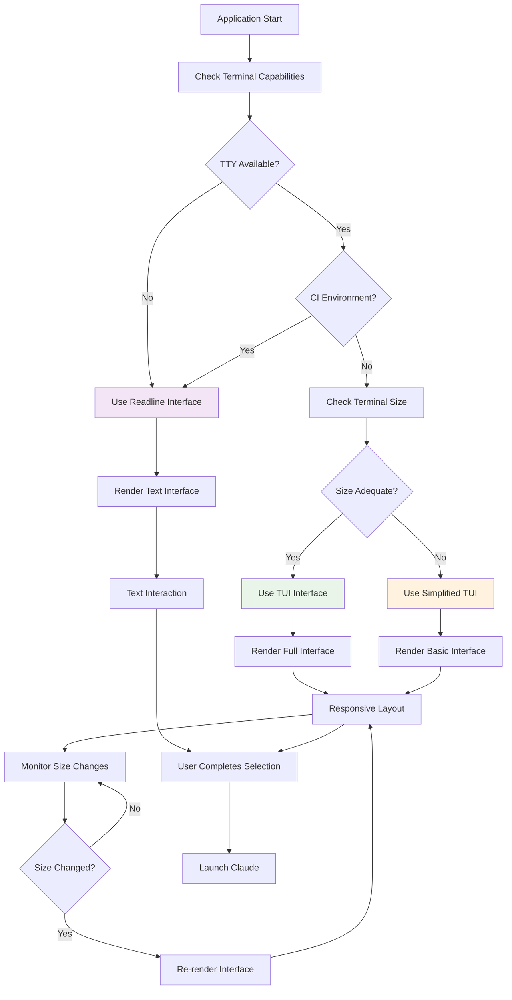

## Security Architecture

### Input Validation and Sanitization Flow

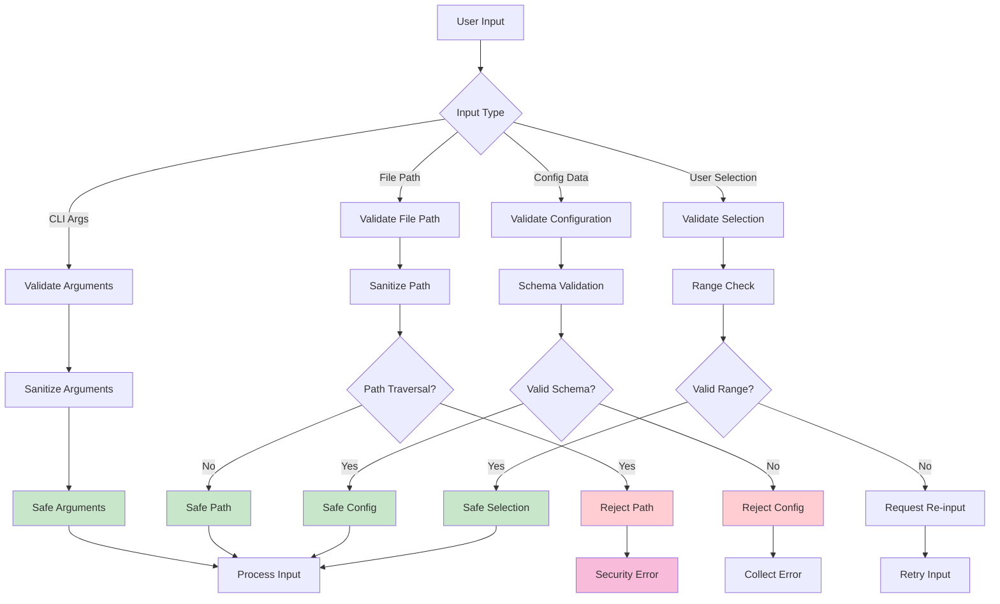

## Summary

These visual diagrams provide a complete understanding of the ccmcp application's architecture, data flow, user interactions, and technical implementation. They document the following key features:

### Core Features

- **Configuration Discovery & Validation**: Automatic scanning and Zod-based validation of MCP server configurations
- **Interactive Selection**: Both TUI (Ink-based) and readline fallback interfaces
- **Selection Caching**: Persistent storage of user preferences per project/config-dir combination
- **Cache Maintenance**: Cleanup command to remove stale entries, invalid references, and broken symlinks
- **Process Management**: Seamless handoff to Claude Code with proper signal handling

### Key Components

- **CLI Layer**: Argument parsing, command routing, and main application flow
- **Application Core**: Scanner, selector, launcher, cache, cleanup, and utilities
- **Validation Layer**: Zod schemas for stdio, HTTP, and SSE server configurations
- **TUI Layer**: React-based components with preview and error display capabilities
- **External Systems**: File system, cache directory, and Claude Code process

### User Workflows

1. **Standard Selection**: Scan → Load Cache → Select → Save Cache → Launch
2. **Cleanup Workflow**: Scan Cache → Identify Issues → Prompt User → Clean → Report
3. **Cache Management**: Ignore cache (`-i`), skip saving (`-n`), or clear all (`--clear-cache`)

These diagrams serve as both documentation and implementation guides for understanding and maintaining the system.
