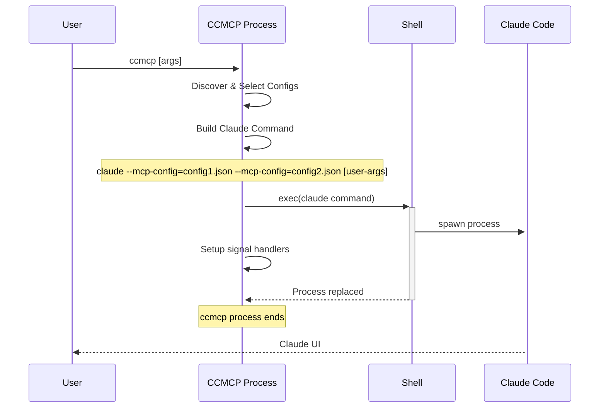

# Visual Architecture Diagrams

This document contains comprehensive visual diagrams created with Mermaid to illustrate the ccmcp application's architecture, data flow, component interactions, and user experience.

## Application Flow Overview

### High-Level Application Flow

## Component Architecture

### System Architecture Diagram

## Data Flow Diagrams

### Configuration Discovery and Validation Flow

### User Interface State Machine

### TUI Component Interaction

## Process Management

### Claude Code Launch Process

### Signal Handling Flow

## Error Handling Diagrams

### Error Classification and Recovery

### Configuration Validation Pipeline

## User Experience Flow

### Complete User Journey

### Interface Adaptation Flow

## Security Architecture

### Input Validation and Sanitization Flow

These visual diagrams provide a complete understanding of the ccmcp application's architecture, data flow, user interactions, and technical implementation. They serve as both documentation and implementation guides for recreating the system.
