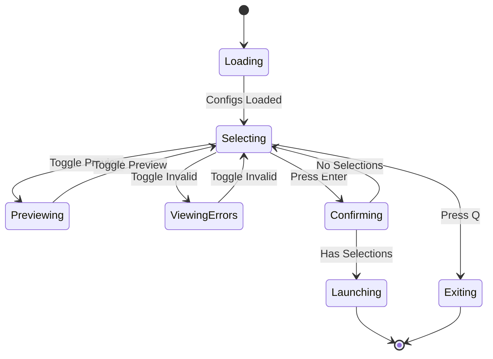

# User Interface Specifications

This document provides comprehensive specifications for the ccmcp user interface, including terminal interface requirements, interaction flows, keyboard shortcuts, and user experience design.

## Overview

The ccmcp application provides two interface modes with automatic fallback to ensure compatibility across different terminal environments:

1. **TUI Mode**: Rich interactive interface using React/Ink for TTY-capable terminals
2. **Readline Mode**: Text-based fallback interface for non-TTY environments

## Interface Selection Strategy

### TTY Detection

The application automatically detects terminal capabilities and selects the appropriate interface:

```typescript
function canUseTUI(): boolean {
  return process.stdout.isTTY && process.stdin.isTTY && !process.env.CI;
}

if (canUseTUI()) {
  await showTUISelector(configs);
} else {
  await showReadlineSelector(configs);
}
```

**TTY Detection Criteria**:

- `process.stdout.isTTY` - Terminal supports output formatting
- `process.stdin.isTTY` - Terminal supports interactive input
- `!process.env.CI` - Not running in CI environment

**Fallback Scenarios**:

- Non-interactive shells (scripts, automation)
- CI/CD environments
- Pipes and redirections
- Remote terminals without full TTY support
- Windows Command Prompt (limited support)

## TUI Mode (Interactive Terminal Interface)

### Main Components

#### Configuration List

- **Layout**: Vertical scrollable list of available configurations
- **Selection Indicators**: Visual checkboxes (☑/☐) for selected/unselected items
- **Current Item Highlight**: Different background color for currently focused item
- **Status Icons**: Visual indicators for configuration state
  - ✓ Valid configuration
  - ✗ Invalid configuration
  - 🔍 Preview enabled

#### Preview Panel

- **Toggle**: Optional side panel showing configuration file content
- **Content**: JSON formatted with basic syntax highlighting
- **Responsive**: Adapts size based on terminal dimensions
- **Scrolling**: Supports vertical scrolling for large files

#### Status Bar

- **Selection Count**: Shows "X of Y selected"
- **Help Text**: Context-sensitive keyboard shortcut reminders
- **Error Count**: Number of invalid configurations when present

#### Error Display

- **Collapsible**: Can be expanded/collapsed to show invalid configurations
- **Error Details**: File path and specific validation error messages
- **Visual Indicators**: Color-coded error types (parse vs validation)

### Keyboard Navigation

#### Primary Navigation

| Key     | Action   | Description                          |
| ------- | -------- | ------------------------------------ |
| `↑`     | Previous | Move selection up one item           |
| `↓`     | Next     | Move selection down one item         |
| `Space` | Toggle   | Toggle selection of current item     |
| `Enter` | Confirm  | Confirm selections and launch Claude |
| `q`     | Quit     | Exit without launching               |

#### Bulk Operations

| Key | Action     | Description                     |
| --- | ---------- | ------------------------------- |
| `a` | Select All | Select all valid configurations |
| `c` | Clear All  | Clear all selections            |

#### View Controls

| Key | Action         | Description                           |
| --- | -------------- | ------------------------------------- |
| `p` | Toggle Preview | Show/hide configuration preview panel |
| `i` | Toggle Invalid | Show/hide invalid configurations      |
| `e` | Expand Errors  | Expand/collapse error details         |

### Visual Design

#### Color Scheme

```
Selected Item:       Green background, white text
Current Item:        Blue background, white text
Valid Config:        White text
Invalid Config:      Red text, dimmed
Preview Panel:       Gray background, light text
Status Bar:          Inverse colors (background as foreground)
Error Messages:      Red text
Help Text:           Dim/gray text
```

#### Layout Structure

```
┌─ Configuration Selector ──────────────┬─ Preview Panel ─────┐
│ ☑ filesystem (Local filesystem)       │ {                   │
│ ☐ database (PostgreSQL server)        │   "mcpServers": {   │
│ ☑ weather-api (Weather service)       │     "filesystem": { │
│ ☐ invalid-config (Parse error)        │       "type": "...  │
│                                        │     }               │
│ ──────── Invalid Configurations ───── │   }                 │
│ ✗ broken.json: Invalid JSON syntax    │ }                   │
│ ✗ missing.json: Required field missing│                     │
├────────────────────────────────────────┴─────────────────────┤
│ 2 of 4 selected • p: preview • q: quit • Enter: launch       │
└───────────────────────────────────────────────────────────────┘
```

#### Responsive Layout

- **Minimum Width**: 80 columns for basic functionality
- **Minimum Height**: 10 rows for minimal interface
- **Preview Panel**: Auto-hides when terminal width < 120 columns
- **Error Section**: Auto-collapses when terminal height < 20 rows

### State Management

#### Configuration State

```typescript
interface TUIState {
  configs: MCPConfig[];
  invalidConfigs: InvalidConfig[];
  selectedConfigs: Set<string>;
  currentIndex: number;
  showPreview: boolean;
  showInvalid: boolean;
  expandedErrors: boolean;
}
```

#### State Transitions



## Readline Mode (Fallback Interface)

### Interface Design

#### Configuration Display

```
Available MCP configurations:

1. filesystem (Local filesystem access)
2. database (PostgreSQL database server)
3. weather-api (Weather service integration)
4. code-analysis (Code analysis tools)

Invalid configurations:
- broken.json: Invalid JSON syntax
- missing.json: Missing required field 'command'

Select configurations (comma-separated numbers, ranges supported): 1,3-4
Selected: filesystem, weather-api, code-analysis

Launch Claude with selected configurations? [Y/n]: y
```

#### Input Validation

- **Number Ranges**: Supports "1,3,5-7,9" format
- **Error Handling**: Clear error messages for invalid input
- **Retry Logic**: Allows user to re-enter on invalid input
- **Default Behavior**: Empty input selects no configurations

### Interaction Flow

#### Selection Process

1. **Display**: List all valid configurations with numbers
2. **Show Invalid**: Display invalid configurations (informational only)
3. **Prompt**: Ask for selection using numbers/ranges
4. **Validate**: Check input format and range validity
5. **Confirm**: Show selected configurations for review
6. **Launch**: Final confirmation before launching Claude

#### Input Parsing

```typescript
function parseSelection(input: string, maxIndex: number): number[] {
  // Examples:
  // "1,3,5" -> [1, 3, 5]
  // "1-3,5" -> [1, 2, 3, 5]
  // "all" -> [1, 2, 3, ..., maxIndex]
  // "" -> []
}
```

#### Error Messages

- **Invalid Numbers**: "Invalid selection: 'abc' is not a number"
- **Out of Range**: "Selection 5 is out of range (max: 4)"
- **Invalid Format**: "Invalid format. Use comma-separated numbers or ranges (1,3,5-7)"

## User Experience Guidelines

### Discoverability

- **Help Text**: Always visible keyboard shortcuts in TUI mode
- **Context Hints**: Prompts explain available actions in readline mode
- **Progressive Disclosure**: Advanced features shown only when relevant

### Feedback

- **Immediate**: Visual feedback for all user actions
- **Clear States**: Obvious indication of current mode and available actions
- **Error Recovery**: Clear instructions for fixing problems

### Accessibility

- **High Contrast**: Compatible with terminal color schemes
- **Screen Readers**: Descriptive text for all interface elements
- **Keyboard Only**: Full functionality without mouse
- **Size Adaptation**: Works across terminal sizes

### Performance

- **Responsive**: UI updates immediately on user input
- **Lazy Loading**: Preview content loaded on demand
- **Efficient Rendering**: Minimal redraws for smooth experience
- **Memory Conscious**: Cleanup of resources when switching modes

## Error States and Recovery

### No Configurations Found

```
No MCP configurations found in ~/.claude/mcp-configs

To get started:
1. Create configuration files in the config directory
2. Use --config-dir to specify a different location
3. Set CCMCP_CONFIG_DIR environment variable

Launching Claude directly without MCP configurations...
```

### All Configurations Invalid

```
Found 3 configuration files, but all have errors:

✗ broken.json: Invalid JSON syntax at line 5
✗ missing.json: Missing required field 'command'
✗ bad-url.json: Invalid URL format

Fix the configuration errors or use --config-dir to specify
a directory with valid configurations.

Launch Claude anyway? [y/N]: n
```

### Partial Failure

- **Valid Configs Available**: Show valid configurations, mention invalid ones
- **User Choice**: Allow proceeding with valid configurations only
- **Error Details**: Optional detailed view of invalid configurations

### Terminal Size Constraints

- **Too Small**: Graceful degradation with simplified interface
- **Minimum Requirements**: Clear message if terminal too small to function
- **Responsive Design**: Layout adapts to available space

## Integration Points

### CLI Arguments

- `--help`: Show usage information and exit
- `--version`: Show version and exit
- `--config-dir`: Override default configuration directory
- Passthrough arguments: Forward remaining args to Claude Code

### Environment Variables

- `CCMCP_CONFIG_DIR`: Default configuration directory

### Exit Codes

- `0`: Success - Claude launched
- `1`: Error - Invalid arguments or system error
- `2`: User cancelled - Quit without launching
- `130`: Interrupted - SIGINT received

## Testing Considerations

### Manual Testing Scenarios

- Different terminal sizes and types
- Various keyboard layouts and configurations
- Both TTY and non-TTY environments
- Different numbers of configurations (0, 1, many)
- Mix of valid and invalid configurations

### Automated Testing

- Mock TTY detection for consistent test environment
- Keyboard input simulation for TUI testing
- Process communication for readline testing
- Error condition testing with invalid configurations

This user interface specification provides complete guidance for implementing both interface modes with consistent behavior and robust error handling.
